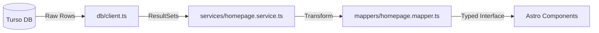

# Turso Data Access Architecture

This document describes the flow of data from the Turso (LibSQL) database to the Astro frontend components.

## 1. Architecture Flow

## 2. Layers Responsibility

### Database Client (`src/lib/db/client.ts`)
- Manages the connection to the Turso edge database.
- Handles environment variables (`TURSO_DATABASE_URL`, `TURSO_AUTH_TOKEN`).
- Provides a singleton instance for efficient connection pooling.

### Service Layer (`src/lib/services/`)
- Orchestrates business logic and data fetching.
- Uses `db.execute()` to run optimized SQL queries.
- Aggregates multiple data sources (e.g., fetching banners and news in parallel).

### Mapper Layer (`src/lib/mappers/`)
- Pure functions that transform "Raw" database rows into "UI-Ready" typed interfaces.
- Handles data formatting (e.g., converting ISO dates to Indonesian locale strings).
- Ensures that if the database schema changes, we only need to update the mapper, not every component.

### Type Layer (`src/types/`)
- The "Source of Truth" for data structures.
- Ensures strict type safety across the entire application.

## 3. SQL Best Practices

- **Parallel Execution**: Use `Promise.all` for fetching multiple independent tables.
- **Filtering**: Always filter by `is_published` or `is_active` flags.
- **Sorting**: Enforce ordering at the database level (`ORDER BY sort_order`).
- **Limiting**: Only fetch what is needed for the preview (`LIMIT 3`, `LIMIT 4`).
